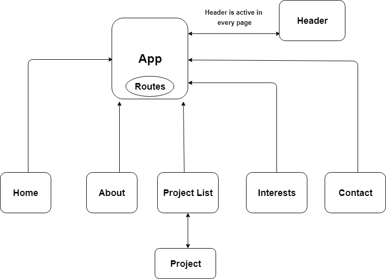

# Portfolio

#### Independent project for Epicodus, React  week 1-2, 02/15/2019-02/23/2019.

### By Gulzat Karimova

## Description

This single page application using React. The Portfolio webpage includes information about me (Gulzat Karimova). 
 
 ## Component Structure Diagram 

 

## Setup/Installation Requirements

1. Clone this repository: https://github.com/gulzatk/react-portfolio.git
3. Install Node.js
2. Open file in a terminal
3. Type $npm install to install plagins and dependencies.
4. Type $npm run start to start the app in the browser.
5. Open up your preferred web browswer and navigate to 'http://localhost:8080/'

## Support and contact details

If you have any questions or suggestions please feel free to email me: gulzat.karimova@gmail.com

## Technologies Used
* VS Code
* Javascript
* React
* Webpack
* Node.js
* Git
* GitHub
* HTML
* CSS

## License
This software is licensed under the MIT license
Copyright (c) 2018 (Gulzat Karimova)
